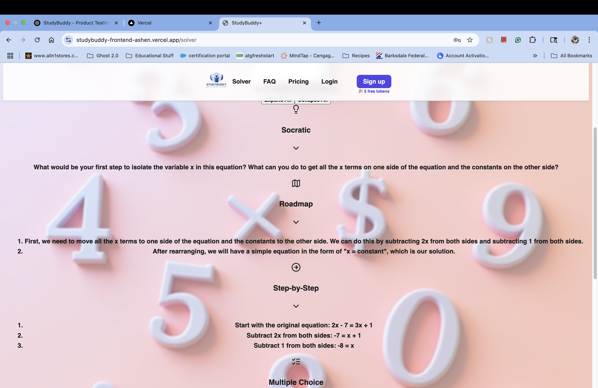
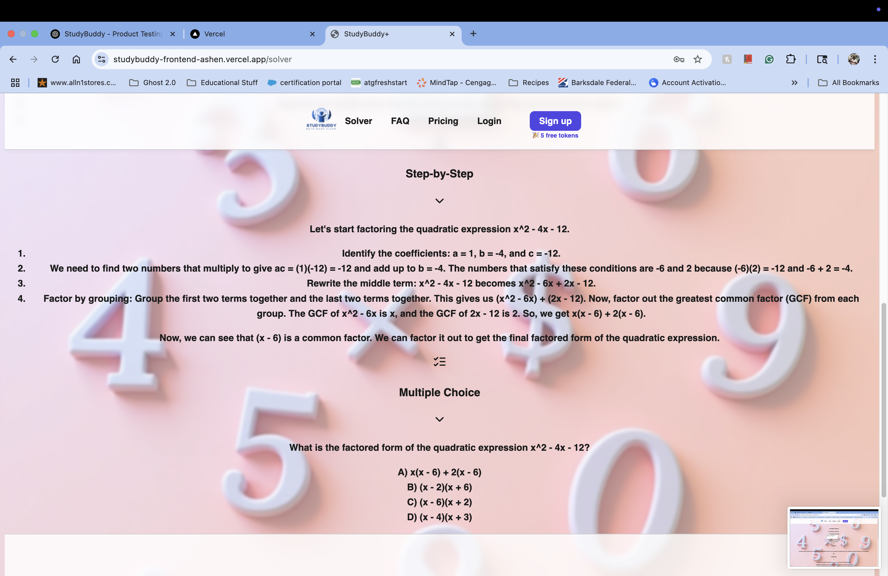
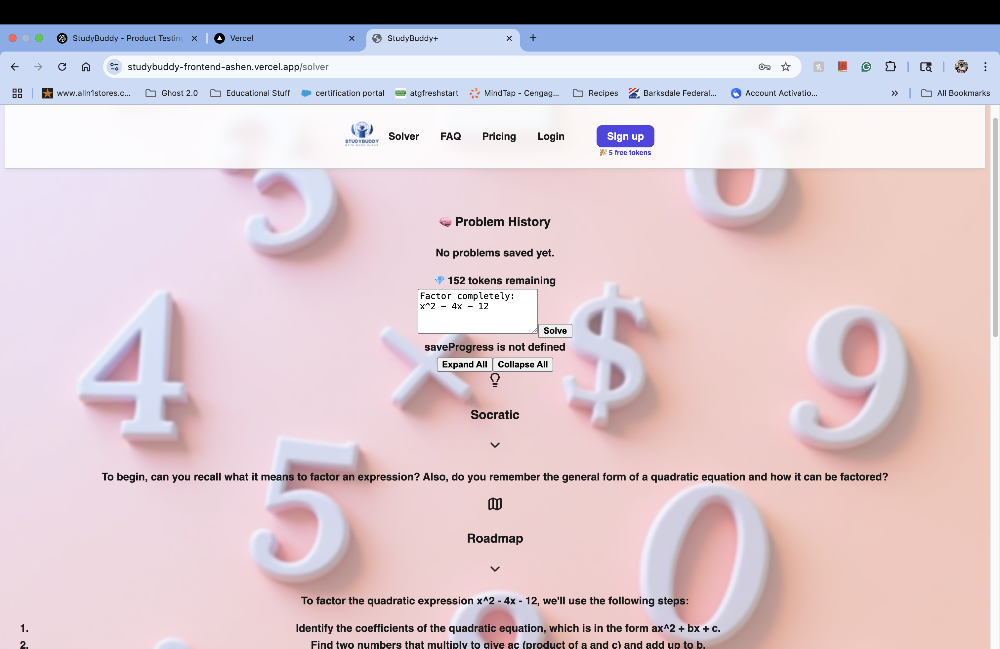
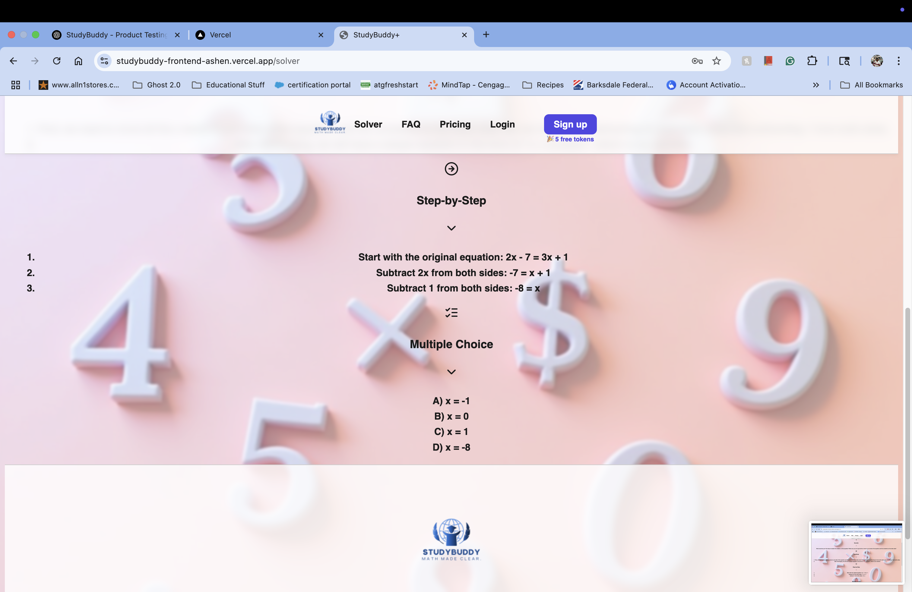

# 📚 StudyBuddy+: An Ethical AI Math Tutor for Schools & Students

# 📚 StudyBuddy+ Demo

**StudyBuddy+** is a web-based educational platform designed to support students, parents, and educators with integrity-driven AI tools. Rather than handing out answers, StudyBuddy+ teaches students **how to solve math problems** through visual, step-by-step 
guidance, Socratic questioning, and interactive animations — all aligned with Common Core standards.

> ✨ Built by a veteran educator and their daughter as part of a mission to create better, safer educational AI.

---

## 🎓 Why We Built This

After over 16 years working in special education across various settings, the lead developer recognized the urgent need for AI that promotes *learning*, not just shortcuts. Existing AI tools often give students final answers too easily, compromising academic integrity.

**StudyBuddy+** was created to restore educational values in the age of AI — helping students build confidence and mastery one step at a time. The project also serves as a real-world software experience for the creator’s daughter, a college Computer Information Systems student.

---

## 🧠 Key Features

- ✏️ **Custom Math Problem Solver**  
  Input any math problem and get structured, step-by-step guidance.

- 💡 **Adaptive Hint System**  
  Supports Socratic questions, multiple-choice hints, and roadmap overviews.

- 📊 **Visual Renderings**  
  Displays graphs and geometric visuals to support understanding.

- 📈 **Progress Tracking & Goal Setting**  
  Lets students and parents track learning progress over time.

- 🔒 **Ethical by Design**  
  Teachers control whether final answers are shown — making it classroom-safe.

---

## 🚀 Try the Demo

🔗 **Live Preview:**  
[https://studybuddy-frontend-ashen.vercel.app](https://studybuddy-frontend-ashen.vercel.app)

> Note: This version is a limited-functionality demo. The full version includes user progress saving, account-based token limits, and more subject coverage.

---

## 🖼️ Demo Preview

StudyBuddy+ walks students through math problems using multiple learning modes:

### ✏️ Linear Equation Walkthrough  

---

### 💡 Socratic & Roadmap Hint Modes  

---

### 🧠 Factoring Quadratics with Explanations  

---

### 💎 Token System & Problem History  

---

## 🧪 Tech Stack

- React + Vite frontend
- Tailwind CSS + shadcn/ui
- OpenAI GPT-4 API (via secure backend)
- Supabase (for auth + token tracking)
- Markdown + SVG rendering

---

## 💬 About the Creators

StudyBuddy+ is developed by a certified special education teacher and a college student pursuing a degree in Computer Information Systems. The project reflects their shared commitment to ethical learning, educational equity, and tech mentorship for the next generation.

---

## 🤝 Contributing / Collaborating

We’re open to collaboration with:
- Educators and districts working to manage AI use in schools
- Developers interested in ethical educational tools
- Investors or organizations supporting EdTech missions

📧 Contact us at: [bltechnologies318@gmail.com](mailto:bltechnologies318@gmail.com)

---

## 📌 License

This repository is a public demonstration. The full backend logic and educational tracking system are private and not included here.  
All content © 2025 Black Lake Forge LLC.
